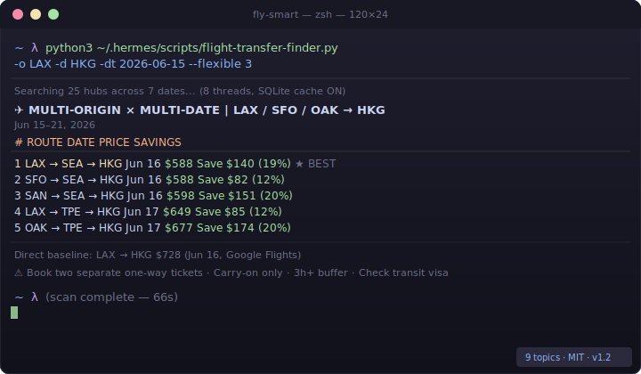

<p align="center">
  <h1 align="center">✈️ fly-smart — Hidden-City Flight Deals</h1>
  <p align="center">
    Find cheaper flights using hub transfer arbitrage — no API key, no browser.<br/>
    Scans 70+ global hubs so Google Flights never has to.
  </p>
  <p align="center">
    <a href="https://github.com/wali-reheman/fly-smart/stargazers"></a>
    <a href="https://github.com/wali-reheman/fly-smart/forks"></a>
    <a href="LICENSE"></a>
    <a href="https://github.com/wali-reheman/fly-smart"></a>
    <a href="https://github.com/wali-reheman/fly-smart/community"></a>
  </p>
  <p align="center">
    <a href="#quick-start">Quick Start</a> ·
    <a href="#how-it-works">How It Works</a> ·
    <a href="#features">Features</a> ·
    <a href="#commands">Commands</a> ·
    <a href="#self-transfer-rules">Rules</a> ·
    <a href="#installation">Install</a>
  </p>
</p>

<p align="center">
  
</p>

---

## Why fly-smart?

Airlines price routes based on demand and hub competition — not just distance. This creates **pricing arbitrage**: flying LAX → SEA → HKG can cost less than LAX → HKG direct. `fly-smart` finds these combos by scanning 70+ global hubs.

- **No API key** — uses Google Flights directly via `fast-flights`
- **No browser** — runs in your terminal, no GUI needed
- **70+ hubs** — Northeast Asia, China, SEA, Middle East, Europe, US coasts
- **Multi-date + multi-origin** — scan ±7 days across LAX, SFO, OAK, SAN simultaneously
- **Rule verification** — checks 3h buffer and transit visa requirements

---

## Quick Start

```bash
# 1. Install
python3 -m venv ~/.hermes/venvs/flight-search
~/.hermes/venvs/flight-search/bin/pip install fast-flights

# 2. Run
python3 ~/.hermes/scripts/flight-transfer-finder.py \
  -o LAX -d HKG -dt 2026-06-15 --flexible 3
```

**Or use it through Hermes Agent:**

> "search flights from LAX to HKG on June 15"

---

## What It Finds

```
✈ MULTI-ORIGIN × MULTI-DATE  |  LAX / SFO / OAK → HKG
                         Jun 15–21, 2026
─────────────────────────────────────────────────────────────
  [ 1]  LAX → SEA → HKG   Jun 16   $588   Save $140 (19%)  ★ BEST
  [ 2]  SFO → SEA → HKG   Jun 16   $588   Save $82  (12%)
  [ 3]  SAN → SEA → HKG   Jun 16   $598   Save $151 (20%)
  [ 4]  LAX → TPE → HKG   Jun 17   $649   Save $85  (12%)
  [ 5]  OAK → TPE → HKG   Jun 17   $677   Save $174 (20%)
─────────────────────────────────────────────────────────────
```

**Real savings (May 2026):**

| Route | Transfer | Savings |
|-------|----------|---------|
| LAX → HKG | via Seattle (SEA) | **$140 saved (19%)** |
| IAD → HKG | via Taipei (TPE) | **$103 saved (11%)** |
| DCA → HKG | via San Diego (SAN) | **$86 saved (8%)** |
| OAK → HKG | via Taipei (TPE) | **$255 saved (24%)** |

---

## Features

| | |
|---|---|
| **70+ global hubs** | Northeast Asia, China, SEA, Middle East, Europe, US coasts |
| **Multi-date** | Scan ±7 days in parallel across all hubs |
| **Multi-origin** | Compare LAX, SFO, SAN, SJC, OAK simultaneously |
| **SQLite cache** | 1-hour TTL — same routes are instant on repeat |
| **Rule verification** | `--verify-rules` checks 3h buffer and transit visa |
| **CSV / Notion export** | `--export-csv` or `--export-notion` |
| **Price alerts** | `--alert-below $X` for cron-style monitoring |

---

## Commands

```bash
# Basic: cheapest transfer route
python3 ~/.hermes/scripts/flight-transfer-finder.py -o LAX -d HKG -dt 2026-06-15

# Flexible dates: scan ±3 days
--flexible 3

# Multi-origin: compare 5 California airports
-o LAX,SFO,OAK,SAN,SJC -d HKG --flexible 3

# Verify self-transfer rules (3h buffer, transit visa)
--verify-rules

# Alert if any deal drops below $600
--alert-below 600

# Export to CSV
--export-csv --csv-output ~/deals.csv

# Export to Notion (set NOTION_FLIGHT_DEALS_DB_ID + NOTION_API_KEY)
--export-notion --notion-database <db-id>

# All hubs (70+) instead of 25
--all-hubs

# Passengers / cabin class
-p 3 -c business

# Skip hub search — direct price only (fast)
--direct-only
```

---

## Self-Transfer Rules

> ⚠️ These deals require **two separate one-way tickets**.

- ✅ **Two separate bookings** — not as a round-trip
- ✅ **Carry-on only** — no checked bags (they won't transfer between tickets)
- ✅ **3+ hour buffer** between connecting legs
- ✅ Check **transit visa** requirements for the hub country

---

## Installation

```bash
# Clone into your Hermes skills directory
git clone https://github.com/wali-reheman/fly-smart.git \
  ~/.hermes/skills/repos/wali-reheman/fly-smart

# Set up Python environment
python3 -m venv ~/.hermes/venvs/flight-search
~/.hermes/venvs/flight-search/bin/pip install fast-flights
```

Then ask Hermes: **"find cheapest flights from LAX to HKG on June 15"**

---

## Contributing

PRs welcome! See [CONTRIBUTING.md](CONTRIBUTING.md) for setup instructions.

---

## License

MIT — see [LICENSE](LICENSE)
