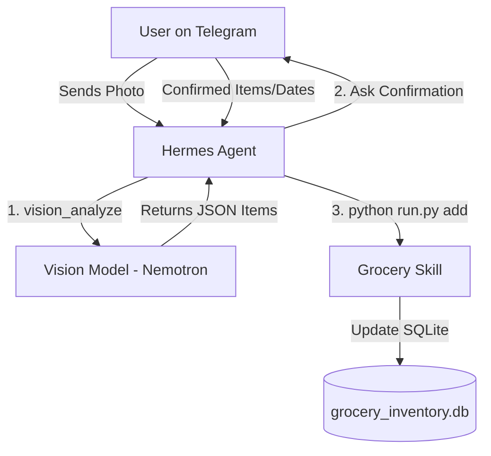

# Grocery Inventory Tracker ☤

A professional Hermes Agent skill for tracking groceries via Telegram and phone camera. Uses vision AI to detect items and stores them in a local SQLite database.

## Architecture

This skill is designed as an "Agent-Native" tool. Instead of bundling heavy vision libraries, it leverages the Hermes Agent's built-in capabilities.



### Components:
1. **Hermes Agent (Gateway)**: Manages the Telegram conversation and handles image routing.
2. **Vision Analyzer**: Uses the Agent's native `vision_analyze` tool to identify groceries.
3. **Grocery Skill (`run.py`)**: A lightweight Python interface that manages the SQLite database.
4. **SQLite Storage**: Persistent inventory stored at `~/.hermes/data/grocery_inventory.db`.

## Installation

This skill has **zero external dependencies** and uses the Python standard library.

1. **Link the skill to Hermes**:
   ```bash
   ln -s $(pwd) ~/.hermes/skills/grocery-inventory
   ```

2. **Restart the Hermes Gateway**:
   Restart your `hermes gateway` process to discover the new skill.

## Usage

### Via Telegram
Simply send a photo of your groceries to your Hermes Agent and say:
> *"Analyze this and add it to my grocery inventory."*

The Agent will identify the items, ask for your confirmation, and then update the database.

### Via CLI
You can also manage the inventory manually:
```bash
# List all items
python scripts/run.py list

# Add items via JSON
python scripts/run.py add '[{"item": "apple", "quantity": 5}]'

# Check if items are in stock
python scripts/run.py check '["milk", "bread"]'
```

## Features
- **Photo Check**: Snap a photo to see if you already have those items in stock.
- **Price Tracking**: Keep track of historical prices (e.g., at Costco) for price matching.
- **Auto-Cleanup**: Automatically remove expired items from your inventory.
- **Inventory Reset**: Snap photos of your fridge/pantry to sync the entire inventory at once.
- **Zero-Config**: No heavy libraries like OpenCV or PyTorch required.
- **Robust Storage**: Uses SQL `UPSERT` logic to manage item quantities.
- **Smart Vision**: Optimized prompts for accurate grocery detection.
- **Developer Friendly**: Clean modular code in `hermes_grocery/`.

## License
MIT